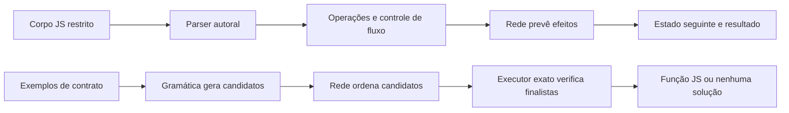

# Interpretação própria por estados e efeitos

Este protótipo investiga aprender o efeito de operações sobre o estado, em vez de gerar texto de código livre. Todos os pesos são inicializados aleatoriamente e treinados no experimento; não usa modelos pré-treinados. Parser, executor, controle de fluxo e gramática de busca são software autoral escrito manualmente. A rede não aprendeu a construir esse interpretador.



## Domínio inicial

`interpretacao_estados.py` aceita corpos de funções com entrada numérica `entrada`, inteiros, variáveis `let`/`const`, atribuições, `+=`, `-=`, soma, subtração, `<`, `===`, `if`/`else`, `while` e `return`. Existe precedência de expressões e negação via `0 - x`. Sem strings, objetos, arrays, funções arbitrárias, imports ou APIs do sistema. Não usa `eval`, `exec` ou execução de código candidato pelo Python. O parser só constrói a estrutura permitida.

É um subconjunto deliberado, não implementação completa de JS: declarações têm escopo de função simplificado, condições exigem booleanos e não há coerção implícita. Entrada e valores numéricos do executor ficam em [-64,64]. Há até 8 variáveis, 512 tokens de fonte, 8 mil caracteres e orçamento padrão de 128 passos (máximo 512). Laço sem fim termina em erro de orçamento. Não aceita modificar `entrada` ou constantes. O trace registra operandos, resultados, origem do efeito e estados antes/depois das atribuições.

`javascript()` envolve um corpo validado numa função `resolver`, com versão TS de entrada tipada. `verificar_estados_js.py` compara o executor exato com JS e TS em runtimes isolados, usando o verificador existente. Isso valida a semântica das referências, não o aprendizado neural.

## Rede de efeitos

`rede_efeitos.py` implementa uma rede NumPy de **584 parâmetros**: MLP tanh de 64 unidades com saída binária para comparações e uma cabeça linear condicionada pelo operador para aritmética. Atributos contêm o operador e os dois operandos normalizados; a cabeça numérica recebe cada operando em canais separados por operação. Não contém soma/subtração pré-calculada nos atributos. Os coeficientes são aprendidos, partindo de valores aleatórios. A saída numérica é arredondada ao inteiro mais próximo, como parte explícita da representação.

O domínio neural é mais estreito: operandos inteiros de -8 a 8, operações `+`, `-`, `<`, `===`. Fora do domínio, retorna erro; não chama o executor exato para aparentar acerto. No modo neural, leitura de variáveis, atribuição e escolha/iteração de blocos são implementadas manualmente; resultados dos operadores vêm exclusivamente da rede.

O gerador autoral cria 1.156 transições e as separa por hash da operação e par não ordenado de operandos. Pares invertidos ficam na mesma partição. Adam treina somente registros de treino, com perdas de regressão aritmética e classificação booleana. Validação e teste são medidos separadamente. Os programas de avaliação não são amostras de treino da rede: compõem operações conhecidas em quatro corpos com múltiplos estados. Isso não mede descoberta de operadores desconhecidos.

## Busca de código

`sintetizar()` recebe exemplos estruturados `{entrada, saida}` de desenvolvimento. A gramática enumera um conjunto limitado de expressões, condições e três laços de acumulação. Sem rede, o executor exato testa candidatos na ordem da gramática. Com rede, a previsão nos exemplos ordena candidatos; até 32 finalistas passam pelo executor exato. A rede não recebe os resultados dos casos reservados, que só são usados na avaliação final.

Uma solução significa apenas que passou os exemplos de desenvolvimento. Não é prova de que satisfaça um contrato geral. Dois programas podem concordar nesses exemplos e divergir em uma entrada inédita. O relatório inclui casos reservados e comparação com busca sem rede. Reduzir candidatos verificados exatamente não significa reduzir tempo total: a ordenação neural percorre a gramática e tem seu próprio custo. Os laços disponíveis foram escritos na gramática; encontrá-los não comprova invenção de algoritmos pela rede.

## Executar

Treino CPU do zero, sem GPU:

```bash
OPENBLAS_NUM_THREADS=1 python scripts/treinar_efeitos.py --saida /tmp/meu-modelo-efeitos --passos 4000
```

Prever execução com a rede:

```bash
python scripts/interpretar_codigo.py --rede /tmp/meu-modelo-efeitos --codigo 'let saldo = entrada + 2; saldo -= 1; return saldo;' --entrada 3
```

Omitir `--rede` usa o executor exato, e o trace identifica essa origem. `--contrato exemplos.json` busca uma função a partir de uma lista de exemplos; pode ser combinado com `--rede` para ordenar candidatos.

O workflow **Interpretação própria por estados e efeitos** roda testes, confirma paridade JS/TS, treina do zero e preserva pesos/configuração/relatório por 30 dias. O experimento permanece separado do gerador Transformer e da aplicação pública.

## Piloto e limites

No piloto local de 4.000 passos (seeds 7/11), houve 104/105 efeitos reservados corretos: soma 32/32, subtração 22/22, menor 32/32, igualdade 18/19. Nos programas de composição, ramificação, laço e acumulação, a rede passou de 2/31 para 31/31 resultados. A busca, tanto simbólica quanto guiada, passou integralmente quatro dos cinco contratos nos casos reservados; o contrato de limiar acertou 2/3, mostrando ambiguidade dos exemplos de desenvolvimento.

Esses números não certificam capacidade geral. É um benchmark pequeno, autoral e público, com um único seed; o piloto inicial foi consultado durante ajustes da representação e não oferece uma avaliação independente intacta. A próxima avaliação deve ampliar operadores, estados, programas e seeds, congelando o desenho antes de produzir novos casos de teste. Técnicas de interpretação, regressão e síntese de programas já existem; esta implementação é uma combinação experimental própria, sem alegação de novidade científica.
