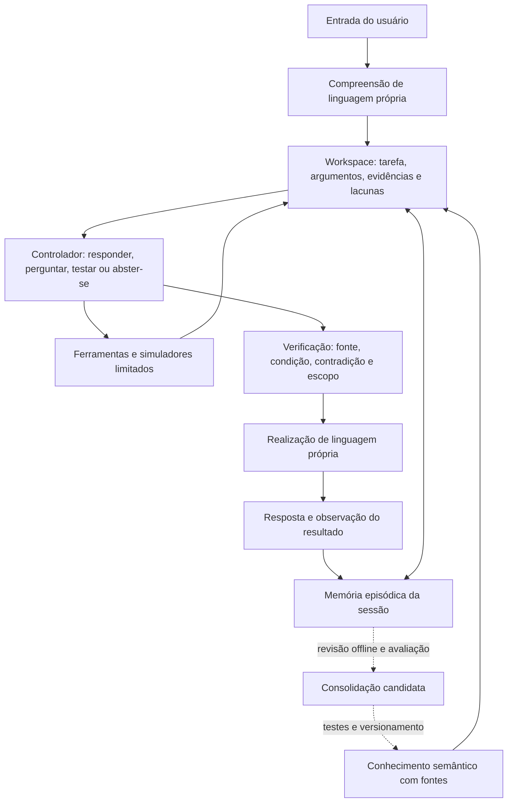

# CRIVO: investigação modular com memória e evidência

## Avaliação da proposta

A direção é boa como arquitetura de engenharia: estado recorrente, memória
externa, habilidades especializadas e seleção de ações podem melhorar um sistema
pequeno. A analogia biológica não demonstra equivalência ao cérebro, consciência
ou inteligência geral. Não há uma correspondência operacional direta entre
hipocampo e um banco de dados, ou entre gânglios da base e um seletor de ações.

O CRIVO atual não é simplesmente entrada → Transformer → saída. A main já tem
classificadores próprios, grafo de conhecimento, consultas relacionais, memória
curta, planejamento, raciocínio com premissas e execução/reparo de um subconjunto
de JavaScript. O Transformer de 2.612.352 parâmetros é usado como pontuador de
frases em um caminho de realização; geração livre continua experimental. A maior
lacuna é compreensão e realização de linguagem que generalizem, acompanhadas de
um controlador que use os módulos existentes de maneira consistente.

O piloto recente mostra por que isso importa: 1.800 passos reduziram a loss nos
exercícios sintéticos, mas pioraram a loss humana. Na avaliação de 72 mensagens,
o motor atual acertou 42, o checkpoint selecionado 30 e o último 18. Uma nova
arquitetura também precisa enfrentar esses contratos; trocar nomes e diagramas
não pode ser contabilizado como melhoria de compreensão.

## Arquitetura proposta



O workspace é o contrato entre módulos. Cada unidade precisa de tipo, origem,
referência, escopo da tarefa, estado ativo e limite de vida. O controlador não
recebe um texto interno arbitrário e o trata como prova. Ele recebe observações,
relações, restrições, previsões e propostas de ações com contratos explícitos.

### Cinco mudanças no plano original

1. **Hipóteses independentes.** Cache, filas e objetos retidos podem coexistir.
   Uma competição que obrigue o sistema a escolher exatamente uma causa pode
   produzir uma conclusão falsa. É preciso avaliar também o que o modelo não
   cobre e preservar hipóteses não testadas.
2. **Memória com proveniência.** Relato, citação, resultado de instrumento,
   hipótese e saída gerada ficam separados. Correções invalidam o estado ativo
   anterior e conservam o rastro dentro do orçamento. Repetição do mesmo registro
   não cria fonte independente nem transforma uma alegação em conhecimento.
3. **Perguntas escolhidas por utilidade.** O controlador deve estimar que
   observação separa hipóteses e quanto ela custa. A estimativa é relativa ao
   modelo; números heurísticos não são probabilidades calibradas. Vale comparar
   essa política com um checklist e com uma política aleatória.
4. **Simulação com condições e limites.** Prever o efeito de um programa em um
   subconjunto interpretado não equivale a prever o mundo. Uma previsão deve
   indicar pressupostos, âmbito e contraexemplos. Medições precisam vir do
   instrumento ou do usuário, jamais da própria simulação.
5. **Consolidação controlada.** Memória de sessão pode mudar imediatamente;
   fatos gerais e pesos exigem revisão, fontes independentes, treino offline,
   teste reservado e possibilidade de reversão. Conhecimento pessoal não deve
   ser publicado ou incorporado ao modelo global automaticamente.

Exemplo de revisão semântica: Dijkstra tem as garantias usuais com pesos não
negativos. Com pesos negativos, alguns grafos produzem respostas corretas e
outros falham; dizer que ele *nunca funciona* é excessivo. A consolidação deve
guardar condições da garantia, não apenas uma frase muito repetida.

## Primeira implementação, disponível no laboratório

`workspace_cognitivo.py` implementa um investigador genérico de observações
categóricas e hipóteses independentes. A cada ciclo, recupera as observações,
confere o domínio, compara restrições, simula respostas possíveis e seleciona
uma pergunta ou uma abstenção. Aguarda evidência nova antes de outro ciclo.

`investigacao_memoria.py` fornece um modelo editorial de heap JavaScript em
Node. Ele distingue o ambiente e a métrica antes de considerar coleta de lixo;
RSS é memória total residente e pode crescer por motivos que não aparecem no
heap JavaScript. O modelo considera crescimento após coleta, cache e fila.
Compatibilidade não prova causalidade, mesmo quando sobra uma única hipótese.

O modelo é simplificado: sem medir processos, executar GC, obter snapshots ou
analisar caminhos de retenção, não identifica um vazamento. Carga variável,
tempos de coleta, alocação nativa e fragmentação podem exigir outro modelo.
As regras são procedurais e autorais; não foram aprendidas por uma rede neural.
As perguntas e a realização textual do exemplo são editoriais. O que este
protótipo exercita é a decisão sobre *qual observação pedir e quando parar*,
não escrita criativa nem compreensão de linguagem livre.

Orçamento: até oito hipóteses, doze perguntas, seis etapas por ciclo, 64 episódios
de observação e 16 propostas, todos por instância. Não há persistência entre
sessões, gravação de conversas, encoders de voz/visão, treino online ou consolidação
automática. Não foi ativado como motor do chat público.

```sh
python scripts/investigar_memoria.py --runtime node --metrica heap
python scripts/investigar_memoria.py --runtime node --metrica heap --pos-gc cresce --cache cresce --fila cresce
python -m unittest testes_workspace_cognitivo -v
python scripts/avaliar_workspace_cognitivo.py --saida avaliacoes/workspace_cognitivo_v1.json
```

Fontes do modelo de memória:

- https://nodejs.org/api/process.html#processmemoryusage
- https://nodejs.org/en/learn/diagnostics/memory/using-gc-traces
- https://developer.mozilla.org/en-US/docs/Web/JavaScript/Guide/Memory_management

## Próximas etapas e critérios de avanço

**Primeiro: ligar compreensão ao estado estruturado.** O encoder próprio deve
extrair objetivo, entidade, métrica, condição, negação e correção com trechos
literais do usuário. Deve recusar quando não consegue sustentar a interpretação.
Treinar com paráfrases e pares que diferem por uma negação ou atribuição; separar
entidades e formas de pergunta na avaliação. Entradas estruturadas deste
laboratório não demonstram que esse encoder já existe ou generaliza.

**Depois: integrar ferramentas e pergunta ativa.** Usar o interpretador JS já
existente para simular somente o subconjunto suportado, com tempo e passos
limitados. Para Node real, usar medições e snapshots fornecidos em um ambiente
de teste apropriado. Medir redução de incerteza, custo, erros de atribuição e
conclusões indevidas. Comparar com a mesma compreensão sem workspace e sem
memória para descobrir qual módulo acrescenta capacidade.

**Em seguida: realização de linguagem condicionada.** O gerador próprio recebe
um plano sustentado por evidências e pelo estado da conversa. Avaliar se ele
preserva condições, negações e restrições ao explicar e reformular. A própria
resposta gerada não vira evidência para o próximo turno. O ciclo maior de treino
de português e diálogo continua em paralelo:
https://github.com/HROSONE/CRIVO/actions/runs/37175073275

**Por último: aprendizagem persistente.** Desenvolver armazenamento por usuário,
política de expiração e exclusão, revisão de candidatos a conhecimento geral e
versionamento. Para habilidades, consolidar exercícios verificados por execução,
preservando dados de teste e modelos anteriores. Uma mudança de pesos só avança
se melhorar tarefas novas e preservar competências anteriores.

A política de controle também pode aprender: manter o seletor procedural como
baseline e treinar uma rede pequena própria para ordenar ações, usando tarefas
em que a consequência possa ser verificada. Não usar o texto produzido pelo
gerador como sua própria recompensa. Separar ganho de informação, custo da ação,
correção do resultado e satisfação do usuário; uma resposta agradável pode estar
errada. Medir a política em tarefas e combinações novas antes de substituir a
baseline. Um simulador aprendido deve ser confrontado com execução real no
domínio suportado; divergências são dados para revisão, não medições inventadas.

Voz e visão vêm depois que esse ciclo funcionar com texto. A arquitetura deverá
merecer sua complexidade: ganhos medidos contra a versão simples, inclusive em
compreensão indireta, reparo de intenção, correções de memória, hipóteses e casos
fora do domínio. Nenhuma fase deve ser chamada de inteligência humana por causa
de uma loss menor ou de uma analogia com uma região do cérebro.
